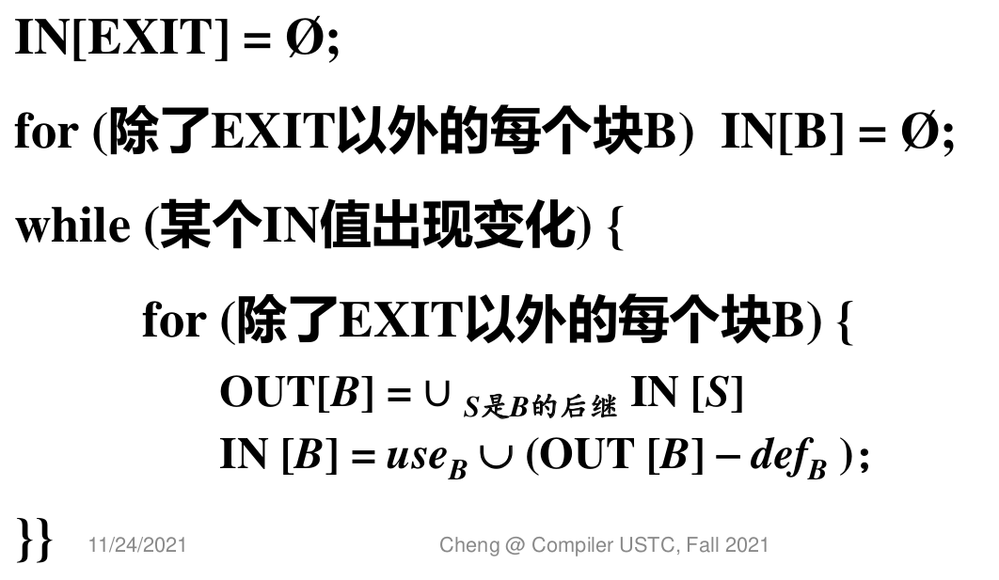

# Lab4 实验报告

组长 汤力宇 PB19111717

组员 李铭铠 PB19111701

## 实验要求

1. 完成**常量传播与死代码删除**优化pass的开发，并保证优化后时间减少超过规定值；

2. 完成**循环不变式外提**优化pass的开发，并保证优化后时间减少超过规定值；

3. 完成**活跃变量分析**pass，并保证生成的`.json`文件与给出结果一致。

## 实验难点
- 正确理解各个优化的内在含义
- 正确编写c++代码，正确调用lightir
## 实验设计

### 常量传播
#### 实现思路
- 按照从前往后的顺序，遍历所有指令：考察产生常量的指令
- 对于**表达式指令**：BinaryInst, CmpInst, FCmpInst, ZextInst, FpToSiInst, SiToFpInst
  - 检查指令的所有operands是否都是常量
    - 通过get_operands()方法遍历所有operand
    - dynamic_cast<Constant *>()成功，则说明是Constant类型
  - 如果是，则根据常量值，计算表达式的常量结果
    - 仅考虑ConstantInt和ConstantFP，则可以通过get_value()方法获取操作数的常量值
    - 通过get_instr_type()方法获取指令的操作符，执行对应的运算，得到常量结果
  - 将常量结果，替换该指令所有的引用
    - 通过replace_all_use_with()方法，将该指令的所有引用处替换为刚刚得到的常量结果
  - 将该指令加入待删除指令集合，指令遍历结束后再删除

- 对于**内存指令**：store, load
  - 考虑单个基本快内，按顺序遍历所有指令
  - 对于一条store指令，检查右值是否是常量
    - 通过get_rval()方法，得到指令的右值
    - 根据dynamic_cast<Constant*>()方法是否成功，判断右值是否是常量
  - 如果右值是常量，则向后遍历直到遇到下一条相同左值的store指令为止：找所有相同左值的load指令
    - 创建一个新的for循环，初始化指令迭代器为当前指令迭代器+1
      - (当前指令迭代器指向正在考虑的store指令)
    - 当指令迭代器遇到当前bb的结尾，或者指向另一条具有相同左值的store指令时，循环结束
    - 循环中，先判断是否是load指令，然后通过get_lval()方法判断是否具有相同的左值
  - 对该load指令，将常量右值，替换该指令的所有引用
    - 通过replace_all_use_with()方法
  - 将该load指令，加入待删除指令集合

- 对于**条件分支指令**：br
  - 如果cond是常量，则可以优化为无条件分支指令
  - 对于一条分支指令，先判断是否是条件分支指令
    - 通过is_cond_br()方法
  - 判断条件是否是常量
    - 通过get_operand(0)得到条件
  - 如果是常量（不妨设为true），则将指令改为无条件分支
    - 通过get_operand(1)，可以得到if_true的基本块
    - 通过get_operand(2)，可以得到if_false的基本块
    - 通过remove_operands(1, 2)，将指令设置为无条件跳转指令
    - 通过set_operand(0, if_true)，设置指令无条件跳转目的为if_true
  - 并且修改bb间关系：删除当前bb和if_false之间的联系
    - remove_succ_basic_block(if_false)
    - remove_pre_basic_block(bb)

#### 相应代码
- ConstPropagation类的run方法遍历所有基本快，调用run_bb()方法
```cpp
    for (auto f : m_->get_functions()){
        for(auto bb: f->get_basic_blocks()){
            run_bb(bb);
        }
    }
```
- ConstPropagation类的run_bb()方法，遍历单个基本快内的指令，进行常量传播
- 遍历过程中，将待删除指令加入instr2del集合，遍历完成后，再进行指令删除
```cpp
void ConstPropagation::run_bb(BasicBlock *bb){
    std::vector<Instruction *> instr2del;

    auto instrs = bb->get_instructions();
    for(auto pinstr = instrs.begin(); pinstr != instrs.end(); pinstr++){
        auto instr = *pinstr;

        //1.expression statement:(f)binary+(f)cmp+zext+fptosi+sitofp
        auto const_result = const_folder_->compute(instr); 
        //propagate
        if(const_result != nullptr){
            instr->replace_all_use_with(const_result);
            instr2del.push_back(instr);
            continue;
        }

        //2.load-store statement:load+store
        auto instr_store = dynamic_cast<StoreInst*>(instr);
        if(instr_store != nullptr){     //store instr
            auto const_rval = dynamic_cast<Constant*>(instr_store->get_rval());
            if(const_rval != nullptr){    //const rval
                //propagate to rest of the bb
                auto lval = instr_store->get_lval();
                auto pinstr_res = pinstr;
                pinstr_res++;   //skip current instr(instr_store)
                for(; pinstr_res != instrs.end(); pinstr_res++){
                    auto instr_res = *pinstr_res;
                    //another store to the same lval, stop propagation 
                    auto instr_store_1 = dynamic_cast<StoreInst*>(instr_res);
                    if(instr_store_1 != nullptr && instr_store_1->get_lval() == lval){
                        break;
                    }
                    //load with same lval, propagate
                    auto instr_load = dynamic_cast<LoadInst*>(instr_res);
                    if(instr_load != nullptr && instr_load->get_lval() == lval){    //load lval
                        instr_load->replace_all_use_with(const_rval);
                        instr2del.push_back(instr_load);
                    }
                }
            }
            continue;
        }

        //3.br statement with const-cond
        auto instr_br = dynamic_cast<BranchInst*>(instr);
        if(instr_br != nullptr && instr_br->is_cond_br()){      //br instr with cond 
            auto const_cond = dynamic_cast<ConstantInt*>(instr_br->get_operand(0)); 
            if(const_cond != nullptr){      //const cond
                auto if_true = dynamic_cast<BasicBlock*>(instr_br->get_operand(1));
                auto if_false = dynamic_cast<BasicBlock*>(instr_br->get_operand(2));
                instr_br->remove_operands(1, 2);
                
                if(const_cond->get_value()){    //if_true
                    instr_br->set_operand(0, if_true);
                    bb->remove_succ_basic_block(if_false);
                    if_false->remove_pre_basic_block(bb);
                }
                else{   //if_false
                    instr_br->set_operand(0, if_false);
                    bb->remove_succ_basic_block(if_true);
                    if_true->remove_pre_basic_block(bb);
                }
            }
        }

    }

    //del instr
    for(auto instr : instr2del){
        bb->delete_instr(instr);
    }

}
```

- 其中对于**表达式指令**的处理如下
```cpp
        //1.expression statement:(f)binary+(f)cmp+zext+fptosi+sitofp
        auto const_result = const_folder_->compute(instr); 
        //propagate
        if(const_result != nullptr){
            instr->replace_all_use_with(const_result);
            instr2del.push_back(instr);
            continue;
        }
```
- 上述代码调用了ConstFolder类的compute()方法处理表达式指令
  - 如果是一条常量表达式指令，则方法返回计算得到的常量结果
  - 如果不是表达式指令，或者不是常量表达式指令，则返回nullptr
```cpp
Constant *ConstFolder::compute(Instruction *instr)
{    
    //check parameter
    std::vector<Constant *> const_operands;
    for(auto operand : instr->get_operands()){
        auto constant_operand = dynamic_cast<Constant *>(operand);
        //instr not const, abort
        if(!constant_operand){
            return nullptr;
        }
        const_operands.push_back(constant_operand);
    }
    //cal const result
    auto op = instr->get_instr_type();
    switch (op){
        //2 int operands
        case Instruction::add:
        {
            int c_value0 = dynamic_cast<ConstantInt *>(const_operands[0])->get_value();
            int c_value1 = dynamic_cast<ConstantInt *>(const_operands[1])->get_value();
            return ConstantInt::get(c_value0 + c_value1, module_);
            break;
        }
        case Instruction::sub:
        {
            int c_value0 = dynamic_cast<ConstantInt *>(const_operands[0])->get_value();
            int c_value1 = dynamic_cast<ConstantInt *>(const_operands[1])->get_value();
            return ConstantInt::get(c_value0 - c_value1, module_);
            break;
        }
        case Instruction::mul:
        {
            int c_value0 = dynamic_cast<ConstantInt *>(const_operands[0])->get_value();
            int c_value1 = dynamic_cast<ConstantInt *>(const_operands[1])->get_value();
            return ConstantInt::get(c_value0 * c_value1, module_);
            break;
        }
        case Instruction::sdiv:
        {
            int c_value0 = dynamic_cast<ConstantInt *>(const_operands[0])->get_value();
            int c_value1 = dynamic_cast<ConstantInt *>(const_operands[1])->get_value();
            return ConstantInt::get(int(c_value0 / c_value1), module_);
            break;
        }
        //2 fp operands
        case Instruction::fadd:
        {
            float c_value0 = dynamic_cast<ConstantFP *>(const_operands[0])->get_value();
            float c_value1 = dynamic_cast<ConstantFP *>(const_operands[1])->get_value();
            return ConstantFP::get(c_value0 + c_value1, module_);
            break;
        }
        case Instruction::fsub:
        {
            float c_value0 = dynamic_cast<ConstantFP *>(const_operands[0])->get_value();
            float c_value1 = dynamic_cast<ConstantFP *>(const_operands[1])->get_value();
            return ConstantFP::get(c_value0 - c_value1, module_);
            break;
        }
        case Instruction::fmul:
        {
            float c_value0 = dynamic_cast<ConstantFP *>(const_operands[0])->get_value();
            float c_value1 = dynamic_cast<ConstantFP *>(const_operands[1])->get_value();
            return ConstantFP::get(c_value0 * c_value1, module_);
            break;
        }
        case Instruction::fdiv:
        {
            float c_value0 = dynamic_cast<ConstantFP *>(const_operands[0])->get_value();
            float c_value1 = dynamic_cast<ConstantFP *>(const_operands[1])->get_value();
            return ConstantFP::get(c_value0 / c_value1, module_);
            break;
        }
        //cmp
        case Instruction::cmp:
        {
            int c_value0 = dynamic_cast<ConstantInt *>(const_operands[0])->get_value();
            int c_value1 = dynamic_cast<ConstantInt *>(const_operands[1])->get_value();
            auto op = dynamic_cast<CmpInst*>(instr)->get_cmp_op();
            return compute_cmp(op, c_value0, c_value1);
            break;
        }
        case Instruction::fcmp:
        {
            float c_value0 = dynamic_cast<ConstantFP *>(const_operands[0])->get_value();
            float c_value1 = dynamic_cast<ConstantFP *>(const_operands[1])->get_value();
            auto op = dynamic_cast<FCmpInst*>(instr)->get_cmp_op();
            return compute_cmp(op, c_value0, c_value1);
            break;
        }
        //1 operand
        case Instruction::zext:
        {
            int c_value0 = dynamic_cast<ConstantInt *>(const_operands[0])->get_value();
            return ConstantInt::get(bool(c_value0), module_);
            break;
        }
        case Instruction::sitofp:
        {
            int c_value0 = dynamic_cast<ConstantInt *>(const_operands[0])->get_value();
            return ConstantFP::get(float(c_value0), module_);
            break;   
        }
        case Instruction::fptosi:
        {
            float c_value0 = dynamic_cast<ConstantFP *>(const_operands[0])->get_value();
            return ConstantInt::get(int(c_value0), module_);
            break;
        }
        //if its other type of instr, also return nullptr
        default:
            return nullptr;
            break;
    }
     
}


```
- ConstFolder类包含内联方法辅助计算cmp类指令(fcmp类似)
```cpp
    Constant *compute_cmp(
        CmpInst::CmpOp cmp_op, int lhs, int rhs){
            switch (cmp_op)
            {
                case CmpInst::CmpOp::EQ:
                {
                    return ConstantInt::get(lhs == rhs, module_);
                    break;
                }
                case CmpInst::CmpOp::NE:
                {
                    return ConstantInt::get(lhs != rhs, module_);
                    break;
                }
                case CmpInst::CmpOp::GT:
                {
                    return ConstantInt::get(lhs > rhs, module_);
                    break;
                }
                case CmpInst::CmpOp::GE:
                {
                    return ConstantInt::get(lhs >= rhs, module_);
                    break;
                }
                case CmpInst::CmpOp::LT:
                {
                    return ConstantInt::get(lhs < rhs, module_);
                    break;
                }
                case CmpInst::CmpOp::LE:
                {
                    return ConstantInt::get(lhs <= rhs, module_);
                    break;
                }
                default:
                    return nullptr;
                    break;
            }
        }
```


- 其中对于**内存指令**的处理如下
  - 通过迭代器pinstr_res扫描bb剩余的指令
```cpp
        //2.load-store statement:load+store
        auto instr_store = dynamic_cast<StoreInst*>(instr);
        if(instr_store != nullptr){     //store instr
            auto const_rval = dynamic_cast<Constant*>(instr_store->get_rval());
            if(const_rval != nullptr){    //const rval
                //propagate to rest of the bb
                auto lval = instr_store->get_lval();
                auto pinstr_res = pinstr;
                pinstr_res++;   //skip current instr(instr_store)
                for(; pinstr_res != instrs.end(); pinstr_res++){
                    auto instr_res = *pinstr_res;
                    //another store to the same lval, stop propagation 
                    auto instr_store_1 = dynamic_cast<StoreInst*>(instr_res);
                    if(instr_store_1 != nullptr && instr_store_1->get_lval() == lval){
                        break;
                    }
                    //load with same lval, propagate
                    auto instr_load = dynamic_cast<LoadInst*>(instr_res);
                    if(instr_load != nullptr && instr_load->get_lval() == lval){    //load lval
                        instr_load->replace_all_use_with(const_rval);
                        instr2del.push_back(instr_load);
                    }
                }
            }
            continue;
        }
```

- 其中对于**条件分支**的处理如下
  - 修改指令为无条件分支指令
  - 修改基本快间联系
```cpp
        //3.br statement with const-cond
        auto instr_br = dynamic_cast<BranchInst*>(instr);
        if(instr_br != nullptr && instr_br->is_cond_br()){      //br instr with cond 
            auto const_cond = dynamic_cast<ConstantInt*>(instr_br->get_operand(0)); 
            if(const_cond != nullptr){      //const cond
                auto if_true = dynamic_cast<BasicBlock*>(instr_br->get_operand(1));
                auto if_false = dynamic_cast<BasicBlock*>(instr_br->get_operand(2));
                instr_br->remove_operands(1, 2);
                
                if(const_cond->get_value()){    //if_true
                    instr_br->set_operand(0, if_true);
                    bb->remove_succ_basic_block(if_false);
                    if_false->remove_pre_basic_block(bb);
                }
                else{   //if_false
                    instr_br->set_operand(0, if_false);
                    bb->remove_succ_basic_block(if_true);
                    if_true->remove_pre_basic_block(bb);
                }
            }
        }
```


#### 优化前后的IR对比（举一个例子）并辅以简单说明：
- 取testcase3为例子
- 优化前
```llvm
; ModuleID = 'cminus'
source_filename = "testcase-3.cminus"

@opa = global i32 zeroinitializer
@opb = global i32 zeroinitializer
@opc = global i32 zeroinitializer
@opd = global i32 zeroinitializer
declare i32 @input()

declare void @output(i32)

declare void @outputFloat(float)

declare void @neg_idx_except()

define i32 @max() {
label_entry:
  %op0 = mul i32 0, 1
  %op1 = mul i32 %op0, 2
  %op2 = mul i32 %op1, 3
  %op3 = mul i32 %op2, 4
  %op4 = mul i32 %op3, 5
  %op5 = mul i32 %op4, 6
  %op6 = mul i32 %op5, 7
  store i32 %op6, i32* @opa
  %op7 = mul i32 1, 2
  %op8 = mul i32 %op7, 3
  %op9 = mul i32 %op8, 4
  %op10 = mul i32 %op9, 5
  %op11 = mul i32 %op10, 6
  %op12 = mul i32 %op11, 7
  %op13 = mul i32 %op12, 8
  store i32 %op13, i32* @opb
  %op14 = mul i32 2, 3
  %op15 = mul i32 %op14, 4
  %op16 = mul i32 %op15, 5
  %op17 = mul i32 %op16, 6
  %op18 = mul i32 %op17, 7
  %op19 = mul i32 %op18, 8
  %op20 = mul i32 %op19, 9
  store i32 %op20, i32* @opc
  %op21 = mul i32 3, 4
  %op22 = mul i32 %op21, 5
  %op23 = mul i32 %op22, 6
  %op24 = mul i32 %op23, 7
  %op25 = mul i32 %op24, 8
  %op26 = mul i32 %op25, 9
  %op27 = mul i32 %op26, 10
  store i32 %op27, i32* @opd
  %op28 = load i32, i32* @opa
  %op29 = load i32, i32* @opb
  %op30 = icmp slt i32 %op28, %op29
  %op31 = zext i1 %op30 to i32
  %op32 = icmp ne i32 %op31, 0
  br i1 %op32, label %label33, label %label39
label33:                                                ; preds = %label_entry
  %op34 = load i32, i32* @opb
  %op35 = load i32, i32* @opc
  %op36 = icmp slt i32 %op34, %op35
  %op37 = zext i1 %op36 to i32
  %op38 = icmp ne i32 %op37, 0
  br i1 %op38, label %label40, label %label46
label39:                                                ; preds = %label_entry, %label46
  ret i32 0
label40:                                                ; preds = %label33
  %op41 = load i32, i32* @opc
  %op42 = load i32, i32* @opd
  %op43 = icmp slt i32 %op41, %op42
  %op44 = zext i1 %op43 to i32
  %op45 = icmp ne i32 %op44, 0
  br i1 %op45, label %label47, label %label49
label46:                                                ; preds = %label33, %label49
  br label %label39
label47:                                                ; preds = %label40
  %op48 = load i32, i32* @opd
  ret i32 %op48
label49:                                                ; preds = %label40
  br label %label46
}
define void @main() {
label_entry:
  %op0 = alloca i32
  store i32 0, i32* %op0
  br label %label1
label1:                                                ; preds = %label_entry, %label6
  %op2 = load i32, i32* %op0
  %op3 = icmp slt i32 %op2, 200000000
  %op4 = zext i1 %op3 to i32
  %op5 = icmp ne i32 %op4, 0
  br i1 %op5, label %label6, label %label10
label6:                                                ; preds = %label1
  %op7 = call i32 @max()
  %op8 = load i32, i32* %op0
  %op9 = add i32 %op8, 1
  store i32 %op9, i32* %op0
  br label %label1
label10:                                                ; preds = %label1
  %op11 = load i32, i32* @opa
  call void @output(i32 %op11)
  %op12 = load i32, i32* @opb
  call void @output(i32 %op12)
  %op13 = load i32, i32* @opc
  call void @output(i32 %op13)
  %op14 = load i32, i32* @opd
  call void @output(i32 %op14)
  ret void
}

```
- 优化后(-mem2reg -const-propagation)
```llvm
; ModuleID = 'cminus'
source_filename = "testcase-3.cminus"

@opa = global i32 zeroinitializer
@opb = global i32 zeroinitializer
@opc = global i32 zeroinitializer
@opd = global i32 zeroinitializer
declare i32 @input()

declare void @output(i32)

declare void @outputFloat(float)

declare void @neg_idx_except()

define i32 @max() {
label_entry:
  store i32 0, i32* @opa
  store i32 40320, i32* @opb
  store i32 362880, i32* @opc
  store i32 1814400, i32* @opd
  br label %label33
label33:                                                ; preds = %label_entry
  %op34 = load i32, i32* @opb
  %op35 = load i32, i32* @opc
  %op36 = icmp slt i32 %op34, %op35
  %op37 = zext i1 %op36 to i32
  %op38 = icmp ne i32 %op37, 0
  br i1 %op38, label %label40, label %label46
label39:                                                ; preds = %label46
  ret i32 0
label40:                                                ; preds = %label33
  %op41 = load i32, i32* @opc
  %op42 = load i32, i32* @opd
  %op43 = icmp slt i32 %op41, %op42
  %op44 = zext i1 %op43 to i32
  %op45 = icmp ne i32 %op44, 0
  br i1 %op45, label %label47, label %label49
label46:                                                ; preds = %label33, %label49
  br label %label39
label47:                                                ; preds = %label40
  %op48 = load i32, i32* @opd
  ret i32 %op48
label49:                                                ; preds = %label40
  br label %label46
}
define void @main() {
label_entry:
  br label %label1
label1:                                                ; preds = %label_entry, %label6
  %op15 = phi i32 [ 0, %label_entry ], [ %op9, %label6 ]
  %op3 = icmp slt i32 %op15, 200000000
  %op4 = zext i1 %op3 to i32
  %op5 = icmp ne i32 %op4, 0
  br i1 %op5, label %label6, label %label10
label6:                                                ; preds = %label1
  %op7 = call i32 @max()
  %op9 = add i32 %op15, 1
  br label %label1
label10:                                                ; preds = %label1
  %op11 = load i32, i32* @opa
  call void @output(i32 %op11)
  %op12 = load i32, i32* @opb
  call void @output(i32 %op12)
  %op13 = load i32, i32* @opc
  call void @output(i32 %op13)
  %op14 = load i32, i32* @opd
  call void @output(i32 %op14)
  ret void
}

```
- 在max函数中，不难发现opa,opb,opc,opd的表达式计算语句被优化删除了，只剩下右值为常量的store语句
- 基于常量store语句，后续对应的load语句（%op28和%op29）也被优化删除
- 引用load值的icmp语句(%op30)的操作数被传播为常量，故比较结果也是常量，从而进一步被优化删除
- 引用icmp比较结果的条件分支语句，进一步被优化为无条件跳转语句(br label %label33)
- 由于实验要求中，对全局变量只需要考虑基本快内的传播，故%label33块内的load，没有进行传播


### 循环不变式外提

#### 实现思路：

首先，被外提的语句应当不会产生副作用，经过分析，以下6条语句不能够被外提：

1. terminator: 如`br`语句和`ret`语句，如果进行外提的话，会导致原来的基本块结构不完整；
2. `phi`语句:`phi`语句的外提会导致该语句的前驱基本块发生变化，影响该语句的结果；
3. `call`语句:函数调用的外提会导致被调用函数中所有语句的整体外提，可能产生影响（如对全局变量）；
4. `load`语句:`load`语句的右值是变量的地址，即使地址不变，每次`load`的结果也很有可能会发生变化；
5. `store`语句:`store`语句的外提，使得该语句的执行先于一些对相同地址的`load`进行，可能会导致这些`load`的结果发生变化。

在确定以上语句不能被外提后，基本的思路是一次遍历扫描循环中的所有左值，二次遍历扫描语句的右值是否与某个左值相同，若没有与之相同的左值，提到这个循环在深度优先遍历下的前驱基本块。有2点需要注意：

1. 对一个循环不用重复进行一次遍历，在第一次进行后，只需要删去提出循环不变式的左值即可（由SSA保证左值互不相同）；
2. 一个外提导致和左值集合的改变，需要重复二次遍历直到无变化。

#### 相应代码：

一次遍历代码：

```cpp
			std::unordered_set<Value*> left_values;
            for(auto bb : *loop){
                for(auto inst : bb->get_instructions()){
                    left_values.insert(inst);
                }
            }
```

二次遍历代码：

```cpp
				for(auto bb : *loop){
                    for(auto inst : bb->get_instructions()){
                        // instructions that can't be hoisted
                        if(inst->is_br() || inst->is_ret()) continue;
                        if(inst->is_phi()) continue;
                        if(inst->is_call()) continue;
                        if(inst->is_load()) continue;
                        if(inst->is_store()) continue;

                        bool hoist = true;
                        for(auto right_value : inst->get_operands()){
                            if(left_values.find(right_value) != left_values.end()){
                                hoist = false;
                                break;
                            }
                        }
                        if(hoist){
                            // instruction can't be modified here
                            // otherwise, bb will be changed thus violates the for iteration attribute
                            flag = true;
                            left_values.erase(inst);
                            struct pair new_pair;
                            new_pair.bb = bb;
                            new_pair.inst = inst;
                            hoist_pairs.push_back(new_pair);
                        }
                    }
                }
```

#### 优化前后的IR对比（举一个例子）并辅以简单说明：

优化前：

```c
; ModuleID = 'cminus'
source_filename = "testcase-1.cminus"

declare i32 @input()

declare void @output(i32)

declare void @outputFloat(float)

declare void @neg_idx_except()

define void @main() {
label_entry:
  %op0 = alloca i32
  %op1 = alloca i32
  store i32 0, i32* %op0
  store i32 0, i32* %op1
  br label %label2
label2:                                                ; preds = %label_entry, %label7
  %op3 = load i32, i32* %op0
  %op4 = icmp slt i32 %op3, 100000000
  %op5 = zext i1 %op4 to i32
  %op6 = icmp ne i32 %op5, 0
  br i1 %op6, label %label7, label %label74
label7:                                                ; preds = %label2
  %op8 = add i32 1, 1
  %op9 = add i32 %op8, 1
  %op10 = add i32 %op9, 1
  %op11 = add i32 %op10, 1
  %op12 = add i32 %op11, 1
  %op13 = add i32 %op12, 1
  %op14 = add i32 %op13, 1
  %op15 = add i32 %op14, 1
  %op16 = add i32 %op15, 1
  %op17 = add i32 %op16, 1
  %op18 = add i32 %op17, 1
  %op19 = add i32 %op18, 1
  %op20 = add i32 %op19, 1
  %op21 = add i32 %op20, 1
  %op22 = add i32 %op21, 1
  %op23 = add i32 %op22, 1
  %op24 = add i32 %op23, 1
  %op25 = add i32 %op24, 1
  %op26 = add i32 %op25, 1
  %op27 = add i32 %op26, 1
  %op28 = add i32 %op27, 1
  %op29 = add i32 %op28, 1
  %op30 = add i32 %op29, 1
  %op31 = add i32 %op30, 1
  %op32 = add i32 %op31, 1
  %op33 = add i32 %op32, 1
  %op34 = add i32 %op33, 1
  %op35 = add i32 %op34, 1
  %op36 = add i32 %op35, 1
  %op37 = add i32 %op36, 1
  %op38 = add i32 %op37, 1
  %op39 = add i32 %op38, 1
  %op40 = add i32 %op39, 1
  store i32 %op40, i32* %op1
  %op41 = load i32, i32* %op0
  %op42 = load i32, i32* %op1
  %op43 = load i32, i32* %op1
  %op44 = mul i32 %op42, %op43
  %op45 = load i32, i32* %op1
  %op46 = mul i32 %op44, %op45
  %op47 = load i32, i32* %op1
  %op48 = mul i32 %op46, %op47
  %op49 = load i32, i32* %op1
  %op50 = mul i32 %op48, %op49
  %op51 = load i32, i32* %op1
  %op52 = mul i32 %op50, %op51
  %op53 = load i32, i32* %op1
  %op54 = mul i32 %op52, %op53
  %op55 = load i32, i32* %op1
  %op56 = mul i32 %op54, %op55
  %op57 = load i32, i32* %op1
  %op58 = load i32, i32* %op1
  %op59 = mul i32 %op57, %op58
  %op60 = load i32, i32* %op1
  %op61 = mul i32 %op59, %op60
  %op62 = load i32, i32* %op1
  %op63 = mul i32 %op61, %op62
  %op64 = load i32, i32* %op1
  %op65 = mul i32 %op63, %op64
  %op66 = load i32, i32* %op1
  %op67 = mul i32 %op65, %op66
  %op68 = load i32, i32* %op1
  %op69 = mul i32 %op67, %op68
  %op70 = load i32, i32* %op1
  %op71 = mul i32 %op69, %op70
  %op72 = sdiv i32 %op56, %op71
  %op73 = add i32 %op41, %op72
  store i32 %op73, i32* %op0
  br label %label2
label74:                                                ; preds = %label2
  %op75 = load i32, i32* %op1
  %op76 = load i32, i32* %op1
  %op77 = mul i32 %op75, %op76
  call void @output(i32 %op77)
  ret void
}
```

优化后：

```c
; ModuleID = 'cminus'
source_filename = "testcase-1.cminus"

declare i32 @input()

declare void @output(i32)

declare void @outputFloat(float)

declare void @neg_idx_except()

define void @main() {
label_entry:
  %op0 = alloca i32
  %op1 = alloca i32
  store i32 0, i32* %op0
  store i32 0, i32* %op1
  %op8 = add i32 1, 1
  %op9 = add i32 %op8, 1
  %op10 = add i32 %op9, 1
  %op11 = add i32 %op10, 1
  %op12 = add i32 %op11, 1
  %op13 = add i32 %op12, 1
  %op14 = add i32 %op13, 1
  %op15 = add i32 %op14, 1
  %op16 = add i32 %op15, 1
  %op17 = add i32 %op16, 1
  %op18 = add i32 %op17, 1
  %op19 = add i32 %op18, 1
  %op20 = add i32 %op19, 1
  %op21 = add i32 %op20, 1
  %op22 = add i32 %op21, 1
  %op23 = add i32 %op22, 1
  %op24 = add i32 %op23, 1
  %op25 = add i32 %op24, 1
  %op26 = add i32 %op25, 1
  %op27 = add i32 %op26, 1
  %op28 = add i32 %op27, 1
  %op29 = add i32 %op28, 1
  %op30 = add i32 %op29, 1
  %op31 = add i32 %op30, 1
  %op32 = add i32 %op31, 1
  %op33 = add i32 %op32, 1
  %op34 = add i32 %op33, 1
  %op35 = add i32 %op34, 1
  %op36 = add i32 %op35, 1
  %op37 = add i32 %op36, 1
  %op38 = add i32 %op37, 1
  %op39 = add i32 %op38, 1
  %op40 = add i32 %op39, 1
  br label %label2
label2:                                                ; preds = %label_entry, %label7
  %op3 = load i32, i32* %op0
  %op4 = icmp slt i32 %op3, 100000000
  %op5 = zext i1 %op4 to i32
  %op6 = icmp ne i32 %op5, 0
  br i1 %op6, label %label7, label %label74
label7:                                                ; preds = %label2
  store i32 %op40, i32* %op1
  %op41 = load i32, i32* %op0
  %op42 = load i32, i32* %op1
  %op43 = load i32, i32* %op1
  %op44 = mul i32 %op42, %op43
  %op45 = load i32, i32* %op1
  %op46 = mul i32 %op44, %op45
  %op47 = load i32, i32* %op1
  %op48 = mul i32 %op46, %op47
  %op49 = load i32, i32* %op1
  %op50 = mul i32 %op48, %op49
  %op51 = load i32, i32* %op1
  %op52 = mul i32 %op50, %op51
  %op53 = load i32, i32* %op1
  %op54 = mul i32 %op52, %op53
  %op55 = load i32, i32* %op1
  %op56 = mul i32 %op54, %op55
  %op57 = load i32, i32* %op1
  %op58 = load i32, i32* %op1
  %op59 = mul i32 %op57, %op58
  %op60 = load i32, i32* %op1
  %op61 = mul i32 %op59, %op60
  %op62 = load i32, i32* %op1
  %op63 = mul i32 %op61, %op62
  %op64 = load i32, i32* %op1
  %op65 = mul i32 %op63, %op64
  %op66 = load i32, i32* %op1
  %op67 = mul i32 %op65, %op66
  %op68 = load i32, i32* %op1
  %op69 = mul i32 %op67, %op68
  %op70 = load i32, i32* %op1
  %op71 = mul i32 %op69, %op70
  %op72 = sdiv i32 %op56, %op71
  %op73 = add i32 %op41, %op72
  store i32 %op73, i32* %op0
  br label %label2
label74:                                                ; preds = %label2
  %op75 = load i32, i32* %op1
  %op76 = load i32, i32* %op1
  %op77 = mul i32 %op75, %op76
  call void @output(i32 %op77)
  ret void
}
```

我们可以很明显的看到，一大堆label 7中的加1的add语句被提到了label entry中，因为这些语句在循环中所得到的值不会发生任何的变化。


### 活跃变量分析

#### 实现思路：

一次遍历，得到def、use、phi_use集合。需要注意的有以下4点：

1. 是变量集合，所以如果是常量，不加入该集合；
2. def集合是语句左值的集合，有以下三个语句由于没有左值，不记录Instruction的返回值：(1)terminator，`br`和`ret`语句；(2)`store`语句；
3. use集合从instruction的操作数中取值，不考虑`phi`语句。对于`br`语句，如果是条件跳转，第一个操作数是变量，其他是label。对于其他语句，操作数（可能没有）都是变量；对于`call`语句，由于其第一个操作数是lable，故对其除了第一个操作数之外的其他操作数进行处理。
4. phi_use集合从phi的操作数中取值，需要记录变量对应的label。在操作数中，变量和对应的label先后依次出现。

二次遍历，执行ppt上伪代码：



其中OUT集合需要作出改变，改为：

$`OUT[B] =\cup_{s是B的后继}IN[S]\cup_{s是B的后继} phi\_uses[S,B]`$。

#### 相应的代码：

一次遍历代码

```cpp
			for(auto bb : func_->get_basic_blocks()){
                // initialize live_in/live_out
                std::set<Value*> new_in;
                std::set<Value*> new_out;
                live_in.insert({bb, new_in});
                live_out.insert({bb, new_out});
                
                // use/phi_use/def for each basic block
                std::set<Value*> def, use;
                std::map<Value*, std::set<Value*>> phi_use;

                for(auto inst : bb->get_instructions()){
                    // use/phi_use
                    if(inst->is_phi()){
                        for(int i=0;i < inst->get_num_operand()-1;i++){
                            Value* right_value = inst->get_operand(i);
                            Value* pre_bb = inst->get_operand(i+1);

                            if(!IS_CONST(right_value) && def.find(right_value) == def.end()){
                                if(phi_use.find(pre_bb) == phi_use.end()){
                                    std::set<Value*> new_set;
                                    phi_use.insert({pre_bb, new_set});
                                }
                                
                                phi_use[pre_bb].insert(right_value);
                            }
                        }
                    }
                    else{
                        if(inst->is_br()){
                            if(dynamic_cast<BranchInst*>(inst)->is_cond_br()){
                                Value* right_value = inst->get_operand(0);
                                if(!IS_CONST(right_value) && def.find(right_value) == def.end()){
                                    use.insert(right_value);
                                }
                            }
                        }
                        else if(inst->is_call()){
                            bool first = true;
                            for(auto right_value : inst->get_operands()){
                                if(first){
                                    first = false;
                                    continue;
                                }
                                if(!IS_CONST(right_value) && def.find(right_value) == def.end()){
                                    use.insert(right_value);
                                }
                            }
                        }
                        else{
                            for(auto right_value : inst->get_operands()){
                                if(!IS_CONST(right_value) && def.find(right_value) == def.end()){
                                    use.insert(right_value);
                                }
                            }
                        }
                    }

                    //def
                    if(inst->is_store() || inst->isTerminator()){
                        continue;
                    }
                    else{
                        // SSA gaurantees that it can't be used before being defed
                        // otherwise, it will be defed twice
                        def.insert(inst);
                    }
                }

                bb2use.insert({bb, use});
                bb2phi_use.insert({bb, phi_use});
                bb2def.insert({bb, def});
            }
```

二次遍历代码

```cpp
			bool flag = true;
            while(flag){
                flag = false;

                for(auto bb : func_->get_basic_blocks()){
                    // live_out[bb]
                    for(auto suc_bb : bb->get_succ_basic_blocks()){
                        for(auto value : live_in[suc_bb]){
                            live_out[bb].insert(value);
                        }
                        if(bb2phi_use[suc_bb].find(bb) != bb2phi_use[suc_bb].end()){
                            for(auto value : bb2phi_use[suc_bb][bb]){
                                live_out[bb].insert(value);
                            }
                        }
                    }

                    // live_in[bb]
                    std::set<Value*> live_in_before;
                    live_in_before.insert(live_in[bb].begin(), live_in[bb].end());

                    for(auto value : live_out[bb]){
                        live_in[bb].insert(value);
                    }
                    for(auto value : bb2def[bb]){
                        live_in[bb].erase(value);
                    }
                    for(auto value : bb2use[bb]){
                        live_in[bb].insert(value);
                    }

                    if(live_in[bb] != live_in_before){
                        flag = true;
                    }
                }
            }
```


### 实验总结

- 对编译器优化的过程有了进一步认识；
- 在SSA和LLVM的前提下，具体分析了不同类型语句在常量传播、死代码删除、循环不变式外提、活跃变量分析中的不同之处，对各语句在LLVM中的数据结构有了进一步认识。


### 实验反馈 （可选 不会评分）

对本次实验的建议

### 组间交流 （可选）

本次实验和哪些组（记录组长学号）交流了哪一部分信息
